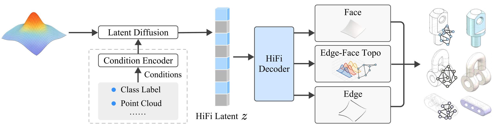

# HiFi-BRep: High-Fidelity Latent Representation for Robust B-Rep Generation

<h4 align="center">
  <a href='https://scholar.google.com/citations?user=IZbQymsAAAAJ&hl' target='_blank'>Junhao Hou</a>
  ·
  <a href='' target='_blank'>Chenqi Luo</a>
  ·
  <a href='' target='_blank'>Pufan Wang</a>
  ·
  <a href='https://scholar.google.com/citations?user=nUFnRo0AAAAJ&hl=en' target='_blank'>Jiaying Lu</a>
  ·
  <a href='http://www.cad.zju.edu.cn/home/ysliu/' target='_blank'>Yusheng Liu</a>
  ·
  <a href='https://scholar.google.com/citations?user=2Y06Jo4AAAAJ&hl=zh-CN' target='_blank'>Feiwei Qin</a>
  ·
  <a href='https://scholar.google.com/citations?user=Se20XL0AAAAJ&hl' target='_blank'>Meie Fang</a>
  ·
  <a href='http://kunzhou.net/' target='_blank'>Kun Zhou</a>
</h4>

<p align="center">
  <a href="https://arxiv.org/abs/2608.16485"></a>
  <a href="https://openaccess.thecvf.com/content/CVPR2026/html/Hou_HiFi-BRep_High-Fidelity_Latent_Representation_for_Robust_B-Rep_Generation_CVPR_2026_paper.html"></a>
  <a href="https://huggingface.co/1nnoh/HiFi-BRep"></a>
  <a href="https://www.modelscope.cn/models/innohou/HiFi-BRep"></a>
</p>



## Installation

HiFi-BRep uses Python 3.10, PyTorch 2.5.1, and CUDA 12.4. See [docs/ENVIRONMENT.md](docs/ENVIRONMENT.md) for the complete installation commands.

```bash
conda create -n hifi-brep python=3.10
conda activate hifi-brep
```

## Checkpoints

Download the inference checkpoints from [HuggingFace](https://huggingface.co/1nnoh/HiFi-BRep) or [ModelScope](https://www.modelscope.cn/models/innohou/HiFi-BRep).

| Variant | Dataset | Faces | Decoder | Diffusion | State |
| --- | --- | ---: | --- | --- | --- |
| `4-30` | DeepCAD | 4–30 | `deepcad/hifi-brep-decoder-4-30.pt` | `deepcad/hifi-brep-diffusion-4-30.pt` | online |
| `7-30` | DeepCAD | 7–30 | `deepcad/hifi-brep-decoder-7-30.pt` | `deepcad/hifi-brep-diffusion-7-30.pt` | online |
| `abc-4-50` | ABC | 4–50 | `abc/hifi-brep-decoder-4-50.pt` | `abc/hifi-brep-diffusion-4-50.pt` | EMA |

HuggingFace:

```bash
hf download 1nnoh/HiFi-BRep \
  --include "deepcad/*.pt" "abc/*.pt" \
  --local-dir checkpoints
```

ModelScope:

```bash
python -m pip install modelscope-hub==0.1.8
modelscope download innohou/HiFi-BRep \
  --include "deepcad/*.pt" "abc/*.pt" \
  --local-dir checkpoints
```

## Inference Demo

```bash
CUDA_VISIBLE_DEVICES=0 python demo.py \
  --variant 4-30 \
  --num-samples 1 \
  --seed 42 \
  --output-dir outputs/demo/4-30
```

Choose `4-30`, `7-30`, or `abc-4-50` with `--variant`. Sampling uses FP32 and 400-step DDIM with `eta=0.2` by default.

## Evaluation

See [docs/EVALUATION.md](docs/EVALUATION.md) for the evaluation protocol, commands, and reference results.

## Data and Training

- [docs/DATA.md](docs/DATA.md) describes the fixed dataset splits and ABC STEP preprocessing. Processed PKLs are not distributed with this repository.
- [docs/TRAINING.md](docs/TRAINING.md) provides the VAE-to-DiT training commands, released full-VAE checkpoints, resume usage, and automatic inference-weight outputs.

## Acknowledgements

This code builds on [BrepGen](https://github.com/samxuxiang/BrepGen) and [CLR-Wire](https://github.com/qixuema/CLR-Wire). We thank their authors for releasing their work.

## Citation

If you find our work useful, please cite:

```bibtex
@inproceedings{hou2026hifi,
  title={HiFi-BRep: High-Fidelity Latent Representation for Robust B-Rep Generation},
  author={Hou, Junhao and Luo, Chenqi and Wang, Pufan and Lu, Jiaying and Liu, Yusheng and Qin, Feiwei and Fang, Meie and Zhou, Kun},
  booktitle={Proceedings of the IEEE/CVF Conference on Computer Vision and Pattern Recognition},
  pages={27199--27208},
  year={2026}
}
```
